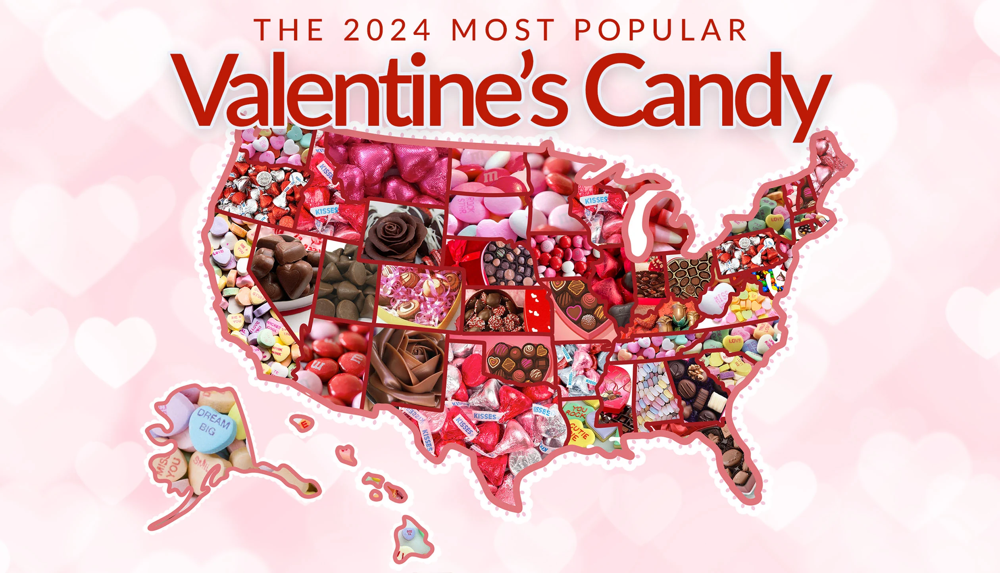
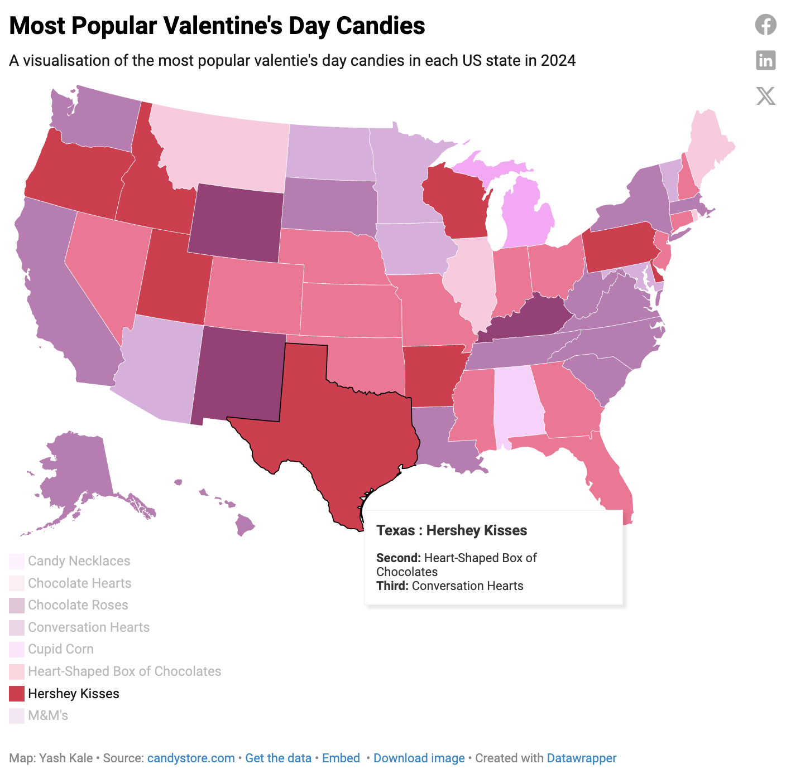

| [home page](https://inferno080.github.io/ykale-dataviz-portfolio/) | [data viz examples](dataviz-examples) | [critique by design](critique-by-design) | [final project I](final-project-part-one) | [final project II](final-project-part-two) | [final project III](final-project-part-three) |

# Most Popular Valentine's Day Candies

## Step 1: The Visualization

</img>
Source: [candystore.com](https://www.candystore.com/blogs/holidays/valentines-candy-popular-states)

This was one of the first visualizations I came across on MakeoverMonday and it caught my eye because of two reasons:
<ol>
  <li>As an international student, when I came across the visualization, I had no idea what candies I was even looking at. I found it very interesting that something that might be easily recognizable to US citizens was so unfamilar to people from other geographic locations. This taught me to never visualize my data in a way that was extremly locale specific and I took on the challenge of making the visualization more inclusive.</li>
  <li>I found the data very relevent with Valenties Day coming up soon, and wanted to work with data that advertisers, groccery chains and candy shoppers would be using this week.</li>
</ol>

## Step 2: The Critique

I think the choropleth map is a great choice for representing this data since it’s location-focused, and I really liked how the fonts and background complemented the theme. The overall aesthetic worked well in telling the story.

However, I found the use of actual candy images instead of color coding to be a major drawback. As someone who didn’t grow up in the U.S., I struggled to recognize many of the chocolates, especially since the map lacked a key or labels. This made it almost impossible to navigate, particularly for chocolates without distinct wrappers. The images also caused the state borders to blend together, making it difficult to distinguish between regions—especially in the Northeast, where things felt cluttered. Texas was another issue, as the border color was too similar to some of the candy wrappers.

If I were to improve this visualization, I would use colors instead of images to represent different chocolates while still keeping the Valentine's Day theme intact. Making the map interactive with a tooltip for the second and third most popular chocolates in each state would add more depth. Adding a key would be crucial for those unfamiliar with these brands, and I’d also ensure that the borders stand out more. Lastly, I’d adjust the title placement so it doesn’t overlap with the map.

Using Stephen Few’s Data Visualization Effectiveness Profile, I’d say the chart is truthful in its representation but lacks completeness due to the missing key and labels. While it does communicate its purpose, the readability issues make it less effective than it could be. It also felt cluttered and distracting, which made it harder to identify patterns. To improve it, I’d recommend replacing images with a color-coded system, adding a legend, and refining the layout to enhance clarity and usability.

## Step 3: Rough Sketch

</img>

## Step 4: Test the solution

Script:

- What are your first impressions when you see this visualization?

- If I could change anything about the colors, what should it be?

- Who do you think is the intended audience for this?

Results: 

| Question | Interview 1 | Interview 2 |
|----------|-------------|-------------|
|      What are your first impressions when you see this visualization?    |      I really like the color theme that you have used. It's cute       |     It took me a second to realise that the map was about candy. The purple/red colors initially looked like an election map to me, especially with Texas being bright red     |
|       If I could change anything about the colors, what should it be?    |      Maybe try shades that are more pink, instead of red/purple. You could also logically group different kinds of candies together into simlar shades       |     I would make Texas and other Southern states more pink/purple to remove the political association        |
|    Who do you think is the intended audience for this?      |     I think this is just a fun light-hearted visualization that you would see on social media, where people might compare their purchasing habits with their neighbours        |       I think that this data could be useful for advertizers to do a market analysis and try to develop marketing startegies    |

Synthesis: 

_What patterns in the feedback emerge?  What did you learn from the feedback?  Based on this feedback, come up with what design changes you think might make the most sense in your final redesign._

## Step five: build the solution

_Include and describe your final solution here. It's also a good idea to summarize your thoughts on the process overall. When you're done with the assignment, this page should all the items mentioned in the assignment page on Canvas(a link or screenshot of the original data visualization, documentation explaining your process, a summary of your wireframes and user feedback, your final, redesigned data visualization, etc.)._

## References
_List any references you used here._

## AI acknowledgements
_If you used AI to help you complete this assignment (within the parameters of the instruction and course guidelines), detail your use of AI for this assignment here._

