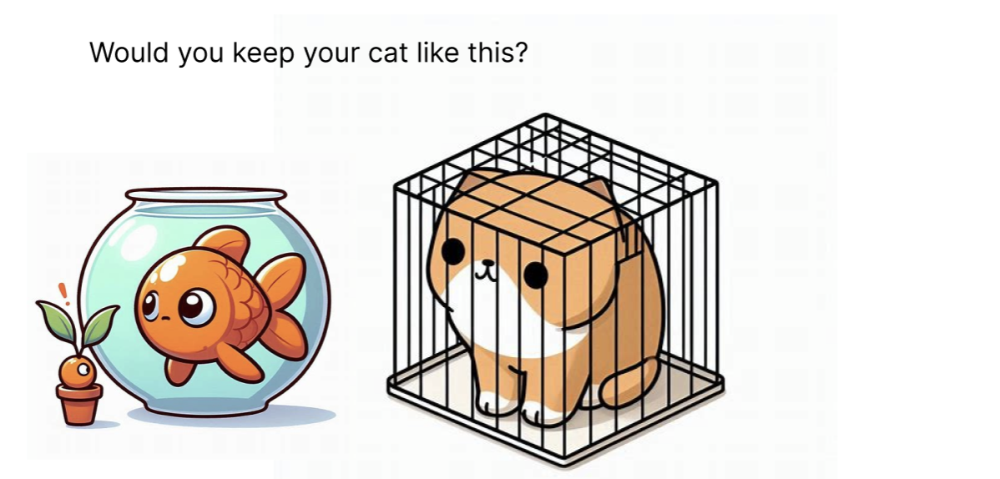

| [home page](https://inferno080.github.io/ykale-dataviz-portfolio/) | [data viz examples](dataviz-examples) | [critique by design](critique-by-design) | [final project I](final-project-part-one) | [final project II](final-project-part-two) | [final project III](final-project-part-three) |

# Outline
Fish are the third most popular pets in the United States, following dogs and cats. Yet, many people see them as mere decorations rather than living creatures with specific care needs. Unfortunately, a lack of information and widespread misinformation often leads to improper fish-keeping practices.

With the help of interactive presentation and interesting visualizations, I aim to address this gap by educating my audience on the proper care and living conditions for popular fish species, ensuring they thrive rather than just survive.

 ## User Story

## Initial sketches
I plan to start the presentation with a word cloud, illustrating the most popular fish in the hobby. After that I plan to include bar charts that denote what people think ideal environments for these fish are. I will be creating both these datasets from scratch. I will be comparing these to a datset I will scrape from wikipedia, that lists the actual ideal paramaters - such as fish size, temperature, etc. My presentation will contain images, and will be very interactive, with AI generated cartoons helping the audience grasp how sardonic the living conditions of some fish are.

# The data
I plan to create my own datasets to gauge user opinions for the bar charts as described above. 

| Name | URL | Description |
|------|-----|-------------|
|   User opinion dataset   |   -  | Will contain dataset of what people pervcieve as ideal living conditions for top 5 popular fish            |
|    Popular fish dataset  |   -  | Will be used for world cloud, self created            |
|   List of freshwater fish aquatic species    |  https://en.wikipedia.org/wiki/List_of_freshwater_aquarium_fish_species  |    A wikipedia list of freshwater fish and their living conditions        |

# Method and medium
I plan to use Tableau for most of my visualizations due to high customizability that it provides. It would also be really easy to embed the charts on webpages. I plan to use bingAI to generate cartoons/artwork for my presentations.

## AI acknowledgements
Used for image generation of the goldfish and cat.
